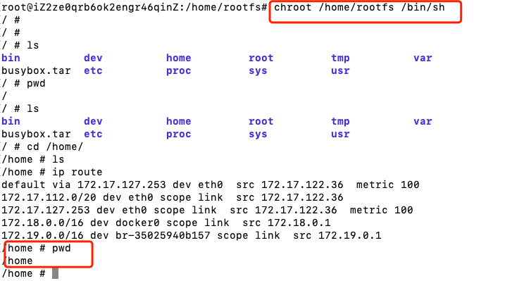
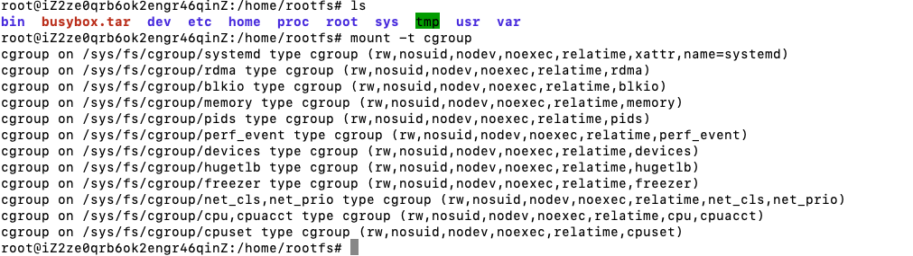
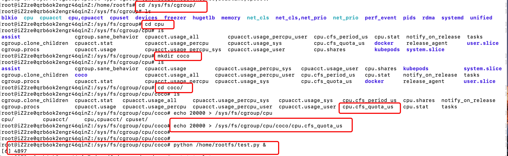
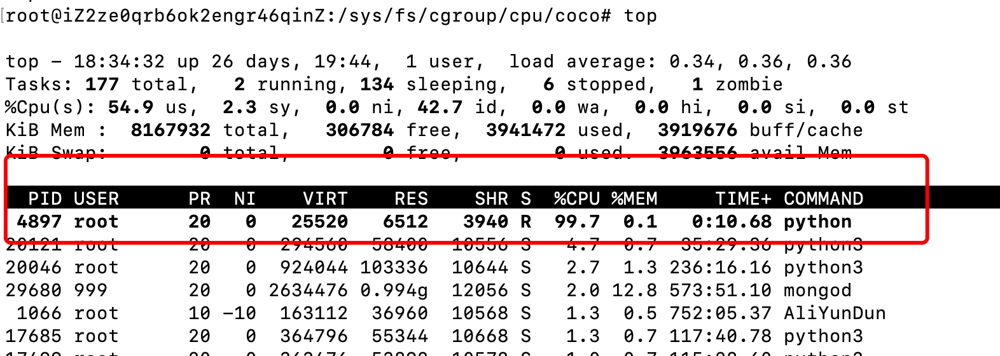
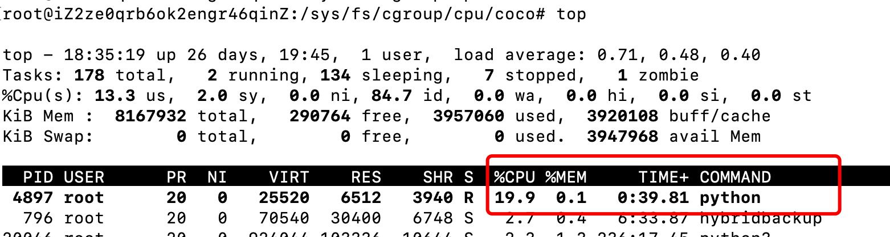
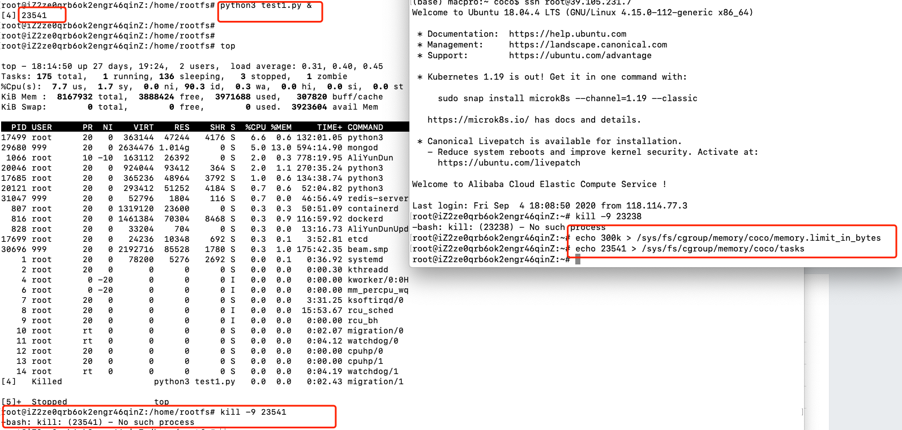

# Docker技术原理

> Auth: 王海飞
>
> Data：2020-09-05
>
> QQ群：223058292
>
> WX：wanghaifeige
>
> Email：779598160@qq.com
>
> github：https://github.com/coco369/knowledge
>
> 知乎Docker专栏：<https://zhuanlan.zhihu.com/c_1285288092883734528>
>
> 知乎Python入门专栏：<https://zhuanlan.zhihu.com/c_1277570999509757952>>

------

#### **先聊聊Docker 的基础内容：Docker 能做什么，怎么安装 Docker，以及容器技术的原理。**

### 1. Docker 能做什么？

​	众所周知，Docker 是一个用于开发，发布和运行应用程序的开放平台。通俗地讲，Docker 类似于集装箱。在一艘大船上，各种货物要想被整齐摆放并且相互不受到影响，我们就需要把各种货物进行集装箱标准化。有了集装箱，我们就不需要专门运输水果或者化学用品的船了。我们可以把各种货品通过集装箱打包，然后统一放到一艘船上运输。Docker 要做的就是把各种软件打包成一个集装箱（镜像），然后分发，且在运行的时候可以相互隔离。

到此，相信你已经迫不及待想要体验下了，下面就让我们来安装一个 Docker。


#### **2. CentOS 下安装 Docker**

​	Docker 是跨平台的解决方案，它支持在当前主流的各大平台安装，包括 Ubuntu、RHEL、CentOS、Debian 等 Linux 发行版，同时也可以在 OSX 、Microsoft Windows 等非 Linux 平台下安装使用。

​	因为 Linux 是 Docker 的原生支持平台，所以推荐你在 Linux 上使用 Docker。由于生产环境中我们使用 CentOS 较多，下面主要针对在 CentOS 平台下安装和使用 Docker 展开介绍。

##### 2.1 操作系统要求

要安装 Docker，我们需要 CentOS 7 及以上的发行版本。

##### 2.2 卸载已有 Docker
如果你已经安装过旧版的 Docker，可以先执行以下命令卸载旧版 Docker。

```
$ sudo yum remove docker \
				docker-client \
                docker-client-latest \
                docker-common \
                docker-latest \
                docker-latest-logrotate \
                docker-logrotate \
                docker-engine
```

##### 2.3 安装 Docker

首次安装 Docker 之前，需要添加 Docker 安装源。添加之后，我们就可以从已经配置好的源，安装和更新 Docker。添加 Docker 安装源的命令如下：

```
$ sudo yum-config-manager \
    --add-repo \
    https://download.docker.com/linux/centos/docker-ce.repo
```

正常情况下，直接安装最新版本的 Docker 即可，因为最新版本的 Docker 有着更好的稳定性和安全性。你可以使用以下命令安装最新版本的 Docker。

```
$ sudo yum install docker-ce docker-ce-cli containerd.io
```

安装完成后，使用以下命令启动 Docker。

```
$ sudo systemctl start docker
```

##### 2.4 启动一个 hello world 的容器

```
$ sudo docker run hello-world
Unable to find image 'hello-world:latest' locally
latest: Pulling from library/hello-world
0e03bdcc26d7: Pull complete
Digest: sha256:7f0a9f93b4aa3022c3a4c147a449bf11e0941a1fd0bf4a8e6c9408b2600777c5
Status: Downloaded newer image for hello-world:latest
Hello from Docker!
```

运行上述命令，Docker 首先会检查本地是否有`hello-world`这个镜像，如果发现本地没有这个镜像，Docker 就会去 **Docker Hub** 官方仓库下载此镜像，然后运行它。最后我们看到该镜像输出 "Hello from Docker!" 并退出。

> 安装完成后默认 docker 命令只能以 root 用户执行，如果想允许普通用户执行 docker 命令，需要执行以下命令 sudo groupadd docker && sudo gpasswd -a ${USER} docker && sudo systemctl restart docker ，执行完命令后，退出当前命令行窗口并打开新的窗口即可。

安装完 Docker，先不着急使用，先来了解下容器的技术原理，这样才能知其所以然。

### 3. 容器技术原理

必须先提一提chroot，因为 chroot 是最早的容器雏形。chroot 意味着切换根目录，有了 chroot 就意味着我们可以把任何目录更改为当前进程的根目录，这与容器非常相似，下面我们通过一个实例了解下 chroot。

#### 3.1 chroot 即 change root directory （更改 root 目录）

​	什么是 chroot 呢？下面是 chroot 维基百科定义：

> chroot 是在 Unix 和 Linux 系统的一个操作，针对正在运作的软件行程和它的子进程，改变它外显的根目录。一个运行在这个环境下，经由 chroot 设置根目录的程序，它不能够对这个指定根目录之外的文件进行访问动作，不能读取，也不能更改它的内容。

​	通俗地说 ，chroot 就是可以改变某进程的根目录，使这个程序不能访问目录之外的其他目录，这个跟我们在一个容器中是很相似的。

​	在经过 chroot 之后，系统读取到的目录和文件将不在是旧系统根下的而是新根下(即被指定的新的位置)的目录结构和文件，因此它带来的好处大致有以下3个：

1. 增加了系统的安全性，限制了用户的权力；

   在经过 chroot 之后，在新根下将访问不到旧系统的根目录结构和文件，这样就增强了系统的安全性。这个一般是在登录 (login) 前使用 chroot，以此达到用户不能访问一些特定的文件。

2. 建立一个与原系统隔离的系统目录结构，方便用户的开发；

   使用 chroot 后，系统读取的是新根下的目录和文件，这是一个与原系统根下文件不相关的目录结构。在这个新的环境中，可以用来测试软件的静态编译以及一些与系统不相关的独立开发。

3. 切换系统的根目录位置，引导 Linux 系统启动以及急救系统等。

   chroot 的作用就是切换系统的根位置，而这个作用最为明显的是在系统初始引导磁盘的处理过程中使用，从初始 RAM 磁盘 (initrd) 切换系统的根位置并执行真正的 init。另外，当系统出现一些问题时，我们也可以使用 chroot 来切换到一个临时的系统。


下面我们**通过一个实例来演示下 chroot。**

首先我们在当前/home目录下创建一个 rootfs 目录：

```
$ mkdir rootfs
```

这里为了方便演示，我使用现成的 busybox 镜像来创建一个系统，镜像的概念和组成后面我会详细讲解，如果你没有 Docker 基础可以把下面的操作命令理解成在 rootfs 下创建了一些目录和放置了一些二进制文件。

复制

```
$ cd rootfs 
$ docker export $(docker create busybox) -o busybox.tar
$ tar -xf busybox.tar
```

执行完上面的命令后，在 rootfs 目录下，我们会得到一些目录和文件。下面我们使用 ls 命令查看一下 rootfs 目录下的内容。

复制

```
$ ls
bin  busybox.tar  dev  etc  home  proc  root  sys  tmp  usr  var
```

可以看到我们在 rootfs 目录下初始化了一些目录，下面让我们通过一条命令来见证 chroot 的神奇之处。使用以下命令，可以启动一个 sh 进程，并且把 /home/centos/rootfs 作为 sh 进程的根目录。

复制

```
$ chroot /home/rootfs /bin/sh
```

此时，我们的命令行窗口已经处于上述命令启动的 sh 进程中。在当前 sh 命令行窗口下，我们使用 ls 命令查看一下当前进程，看是否真的与主机上的其他目录隔离开了

```
/ # ls /
bin  busybox.tar  dev  etc  home  proc  root  sys  tmp  usr  var
```

这里可以看到当前进程的根目录已经变成了主机上的 /home/rootfs 目录。这样就实现了当前进程与主机的隔离。到此为止，一个目录隔离的容器就完成了。操作图解如下图所示：



但是，此时还不能称之为一个容器，为什么呢？你可以在上一步（使用 chroot 启动命令行窗口）执行以下命令，查看如下路由信息：

```
/etc # ip route
default via 172.20.1.1 dev eth0
172.17.0.0/16 dev docker0 scope link  src 172.17.0.1
172.20.1.0/24 dev eth0 scope link  src 172.20.1.3
```

执行 ip route 命令后，你可以看到网络信息并没有隔离，实际上进程等信息此时也并未隔离。要想实现一个完整的容器，我们还需要 Linux 的其他三项技术： Namespace、Cgroups 和联合文件系统。

Docker 是利用 Linux 的 Namespace 、Cgroups 和联合文件系统三大机制来保证实现的， 所以它的原理是使用 Namespace 做主机名、网络、PID 等资源的隔离，使用 Cgroups 对进程或者进程组做资源（例如：CPU、内存等）的限制，联合文件系统用于镜像构建和容器运行环境。

下面简单解释下它们的作用

#### **3.2 Namespace**

​	Namespace 是 Linux 内核的一项功能，该功能对内核资源进行隔离，使得容器中的进程都可以在单独的命名空间中运行，并且只可以访问当前容器命名空间的资源。Namespace 可以隔离进程 ID、主机名、用户 ID、文件名、网络访问和进程间通信等相关资源。

Docker 主要用到以下五种命名空间。

- pid namespace：用于隔离进程 ID。
- net namespace：隔离网络接口，在虚拟的 net namespace 内用户可以拥有自己独立的 IP、路由、端口等。
- mnt namespace：文件系统挂载点隔离。
- ipc namespace：信号量,消息队列和共享内存的隔离。
- uts namespace：主机名和域名的隔离。

#### 3.3 Cgroups 即：Linux Control Group

​	Cgroups 是一种 Linux 内核功能，可以限制和隔离进程的资源使用情况（CPU、内存、磁盘 I/O、网络等）。在容器的实现中，Cgroups 通常用来限制容器的 CPU 和内存等资源的使用。

参考地址：<https://coolshell.cn/articles/17049.html>

首先，Linux把CGroup这个事实现成了一个file system，你可以mount。在我的Ubuntu 14.04下，你输入以下命令你就可以看到cgroup已为你mount好了。如下图所示：



在**/sys/fs**下有一个cgroup的目录，这个目录下还有很多子目录，比如： cpu，cpuset，memory，blkio……这些，这些都是cgroup的子系统。分别用于干不同的事的。

#### CPU限制

**1)  先创建一个test.py文件**

```python
def main():
    i = 0
    while True:
        i += 1

if __name__ == '__main__':

    main()
```

**2）执行test.py文件，并查询内存使用情况**


**3) 限制cpu使用效率**



在/sys/fs/cgroup/cpu下创建了一个coco，而且你会发现，一旦你创建了一个子目录，这个子目录里又有很多文件了。其中**cpu.cfs_quota_us**表示该control group限制占用的时间（微秒），默认为-1，表示不限制。如果设为50000，表示占用50000/10000=50%的CPU。

这里，我们设置占用20%的CPU，即把cpu.cfs_quota_us设置为20000。执行命令就是：

```
echo 20000 > /sys/fs/cgroup/cpu/coco/cpu.cfs_quota_us
```

然后执行死循环test.py文件，瞬间cpu就会跑到100%。如下图所示：



我们看到，这个进程的PID是4897，我们把这个进程加到这个cgroup中：

```
echo 4897 >> /sys/fs/cgroup/cpu/coco/tasks
```

然后，就会在top中看到CPU的利用立马下降成20%了。（前面我们设置的20000就是20%的意思）


**4) 查看内存使用情况**




#### 内存限制

##### 1）创建test1.py文件

```
def main():
    i = []
    while True:
        i.append(1)


if __name__ == '__main__':

    main()
```

想要的效果为：i变量一直新增元素，导致i的内存空间会一直增大。

**2） 执行test1.py文件，并通过top观察执行消耗内存情况**

执行test1.py文件，获取到进程PID

```Python
python test1.py &
```

然后可以通过top查看到对应进程的内存使用情况。

**3）限制内存使用情况**



在/sys/fs/cgroup/memory下创建了一个coco，而且你会发现，一旦你创建了一个子目录，这个子目录里又有很多文件了。其中**memory.limit_in_bytes** 或 **memory.memsw.limit_in_bytes** 限制进程内存占用的大小，避免在进程异常时耗尽系统资源

这里，我们设置占用300k的内存使用量，即把memory.limit_in_bytes设置为300k。执行命令就是：

```
echo 300k > /sys/fs/cgroup/memory/coco/memory.limit_in_bytes 
```

然后再把需要限制内存大小的进程加到这个cgroup中：

```
echo 23541 >> /sys/fs/cgroup/memory/coco/tasks
```

最后你会看到，一会上面PID为 23541的进程将会被kill掉。

**4）查看进程**

从上图中可以看出，当执行kill -9 23541时，提示无法找到PID为23541的进程。那就说明当PID为23541的进程消耗的内存超过了300k时，将主动被kill掉了。


#### 3.4 联合文件系统

​	联合文件系统，又叫 UnionFS，是一种通过创建文件层进程操作的文件系统，因此，联合文件系统非常轻快。Docker 使用联合文件系统为容器提供构建层，使得容器可以实现写时复制以及镜像的分层构建和存储。常用的联合文件系统有 AUFS、Overlay 和 Devicemapper 等。