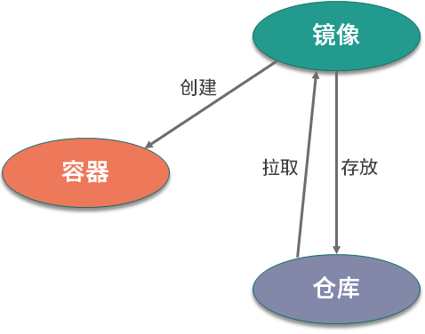
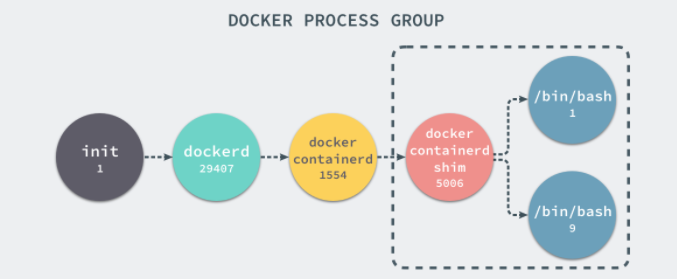

# Docker技术原理

> Auth: 王海飞
>
> Data：2020-09-05
>
> QQ群：223058292
>
> WX：wanghaifeige
>
> Email：779598160@qq.com
>
> github：https://github.com/coco369/docker-depth-learning
>
> 知乎Docker专栏：<https://zhuanlan.zhihu.com/c_1285288092883734528>
>
> 知乎Python入门专栏：<https://zhuanlan.zhihu.com/c_1277570999509757952>

------

Docker 的操作围绕镜像、容器、仓库三大核心概念。在学架构设计之前，我们需要先了解 Docker 的三个核心概念。

### 1. Docker 核心概念

#### 1.1 镜像

镜像是什么呢？通俗地讲，它是一个只读的文件和文件夹组合。它包含了容器运行时所需要的所有基础文件和配置信息，是容器启动的基础。所以你想启动一个容器，那首先必须要有一个镜像。**镜像是 Docker 容器启动的先决条件。**

如果你想要使用一个镜像，你可以用这两种方式：

1. 自己创建镜像。通常情况下，一个镜像是基于一个基础镜像构建的，你可以在基础镜像上添加一些用户自定义的内容。例如你可以基于`centos`镜像制作你自己的业务镜像，首先安装`nginx`服务，然后部署你的应用程序，最后做一些自定义配置，这样一个业务镜像就做好了。
2. 从功能镜像仓库拉取别人制作好的镜像。一些常用的软件或者系统都会有官方已经制作好的镜像，例如`nginx`、`ubuntu`、`centos`、`mysql`等，你可以到 [Docker Hub](https://hub.docker.com/) 搜索并下载它们。

#### 1.2 容器

容器是什么呢？容器是 Docker 的另一个核心概念。通俗地讲，容器是镜像的运行实体。镜像是静态的只读文件，而容器带有运行时需要的可写文件层，并且容器中的进程属于运行状态。即**容器运行着真正的应用进程。容器有初建、运行、停止、暂停和删除五种状态。**

虽然容器的本质是主机上运行的一个进程，但是容器有自己独立的命名空间隔离和资源限制。也就是说，在容器内部，无法看到主机上的进程、环境变量、网络等信息，这是容器与直接运行在主机上进程的本质区别。

#### 1.3 仓库

Docker 的镜像仓库类似于代码仓库，用来存储和分发 Docker 镜像。镜像仓库分为公共镜像仓库和私有镜像仓库。

目前，[Docker Hub](https://hub.docker.com/) 是 Docker 官方的公开镜像仓库，它不仅有很多应用或者操作系统的官方镜像，还有很多组织或者个人开发的镜像供我们免费存放、下载、研究和使用。除了公开镜像仓库，你也可以构建自己的私有镜像仓库，在第 5 课时，我会带你搭建一个私有的镜像仓库。

#### 1.4 镜像、容器、仓库，三者之间的联系



可以看到，镜像是容器的基石，容器是由镜像创建的。一个镜像可以创建多个容器，容器是镜像运行的实体。仓库就非常好理解了，就是用来存放和分发镜像的。

了解了 Docker 的三大核心概念，接下来认识下 Docker 的核心架构和一些重要的组件。

# 2. Docker 架构

在了解 Docker 架构前，我先说下相关的背景知识——容器的发展史。

容器技术随着 Docker 的出现变得炙手可热，所有公司都在积极拥抱容器技术。此时市场上除了有 Docker 容器，还有很多其他的容器技术，比如 CoreOS 的 rkt、lxc 等。容器技术百花齐放是好事，但也出现了很多问题。比如容器技术的标准到底是什么？容器标准应该由谁来制定？

也许你可能会说， Docker 已经成为了事实标准，把 Docker 作为容器技术的标准不就好了？事实并没有想象的那么简单。因为那时候不仅有容器标准之争，编排技术之争也十分激烈。当时的编排技术有三大主力，**分别是 Docker Swarm、Kubernetes 和 Mesos** 。Swarm 毋庸置疑，肯定愿意把 Docker 作为唯一的容器运行时，但是 Kubernetes 和 Mesos 就不同意了，因为它们不希望调度的形式过度单一。

在这样的背景下，最终爆发了容器大战，`OCI`也正是在这样的背景下应运而生。

**`OCI`全称为开放容器标准（Open Container Initiative）**，它是一个轻量级，开放的治理结构。`OCI`组织在 Linux 基金会的大力支持下，于 2015 年 6 月份正式注册成立。基金会旨在为用户围绕工业化容器的格式和镜像运行时，制定一个开放的容器标准。目前主要有两个标准文档：**容器运行时标准 （runtime spec）和容器镜像标准（image spec）**。

正是由于容器的战争，才导致 Docker 不得不在战争中改变一些技术架构。最终形成了下图所示的技术架构。


​					 					Docker 架构图


​	我们可以看到，Docker 整体架构采用 **C/S（客户端 / 服务器）模式**，主要由客户端和服务端两大部分组成。客户端负责发送操作指令，服务端负责接收和处理指令。客户端和服务端通信有多种方式，即可以在同一台机器上通过`UNIX`套接字通信，也可以通过网络连接远程通信。

下面我逐一介绍客户端和服务端。

#### 2.1 Docker 客户端

​	Docker 客户端其实是一种泛称。其中 **docker 命令是 Docker 用户与 Docker 服务端交互的主要方式**。除了使用 docker 命令的方式，还可以使用**直接请求 REST API 的方式与 Docker 服务端交互**，甚至还可以使用各种语言的 SDK 与 Docker 服务端交互。目前社区维护着 Go、Java、Python、PHP 等数十种语言的 SDK，足以满足你的日常需求。如**Python中的docker-py库**。

#### 2.2 Docker 服务端

​	Docker 服务端是 Docker 所有后台服务的统称。其中 **dockerd 是一个非常重要的后台管理进程**，默认的配置文件为/etc/docker/daemon.json。它负责响应和处理来自 Docker 客户端的请求，然后**将客户端的请求转化为 Docker 的具体操作**。例如镜像、容器、网络和挂载卷等具体对象的操作和管理。

​	Docker 从诞生到现在，服务端经历了多次架构重构。起初，服务端的组件是全部集成在 docker 二进制里。但是从 1.11 版本开始， dockerd 已经成了独立的二进制，此时的容器也不是直接由 dockerd 来启动了，而是集成了 containerd、runC 等多个组件。

​	虽然 Docker 的架构在不停重构，但是各个模块的基本功能和定位并没有变化。它和一般的 C/S 架构系统一样，Docker 服务端模块负责和 Docker 客户端交互，并管理 Docker 的容器、镜像、网络等资源。

#### 2.3 Docker 重要组件

看下 Docker 都有哪些工具和组件。在 Docker 安装路径下**/usr/bin** 中执行 ls 命令可以看到以下与 docker 有关的二进制文件。（containerd、containerd-shim、ctr、docker、docker-init、docker-proxy、dockerd、runc）


先简单介绍一下 Docker 的两个至关重要的组件：`runc`和`containerd`。

- `runc`是 Docker 官方按照 OCI 容器运行时标准的一个实现。通俗地讲，runc是一个用来运行容器的轻量级工具，是真正用来运行容器的。
- `containerd`是 Docker 服务端的一个核心组件，它是从`dockerd`中剥离出来的 ，它的诞生完全遵循 OCI 标准，是容器标准化后的产物。`containerd`通过 containerd-shim 启动并管理 runc，**可以说`containerd`真正管理了容器的生命周期。**

##### **首先谈谈dockerd,containerd,docker-shim,runc，每个组件是用来干嘛的**

**2.3.1）dockerd**
​	dockerd本身实属是对容器相关操作的api的最上层封装，直接面向操作用户。

**2.3.2）containerd**
​	dockerd实际真实调用的还是containerd的api接口（rpc方式实现），containerd是dockerd和runc之间的一个中间交流组件。

**2.3.3）containerd-shim**
​	containerd-shim是一个真实**运行的容器的真实垫片载体**，每启动一个容器都会起一个新的containerd-shim的一个进程，他直接通过指定的三个参数：容器id，boundle目录（containerd的对应某个容器生成的目录，一般位于：/var/run/docker/libcontainerd/containerID），运行是二进制（默认为runc）来调用runc的api创建一个容器（比如创建容器：最后拼装的命令如下：runc create）

**2.3.4）runc**
​	runc是一个命令行工具端，他根据`OCI`（开放容器组织）的标准来创建和运行容器。

### 3. Docker 各组件之间的关系

首先通过以下命令来启动一个 busybox 容器：

```
docker run -d busybox sleep 3600
```

为了验证Docker 各组件之间的调用关系，下面使用 pstree 命令查看一下进程父子关系：

```
systemd(1)─┬─Xvfb(17214)─┬─{llvmpipe-0}(18510)
           │             ├─{llvmpipe-1}(18511)
           │             ├─{llvmpipe-2}(18512)
           │             └─{llvmpipe-3}(18513)
           ├─accounts-daemon(1327)─┬─{gdbus}(1495)
           │                       └─{gmain}(1492)
           ├─acpid(1203)
           ├─agetty(23750)
           ├─atd(1223,daemon)
           ├─containerd(22211)─┬─containerd-shim(8473)─┬─sleep(8491)
           │                   │                       ├─{containerd-shim}(8474)
           │                   │                       ├─{containerd-shim}(8475)
           │                   │                       ├─{containerd-shim}(8476)
           │                   │                       ├─{containerd-shim}(8477)
           │                   │                       ├─{containerd-shim}(8478)
           │                   │                       ├─{containerd-shim}(8479)
           │                   │                       ├─{containerd-shim}(8480)
           │                   │                       └─{containerd-shim}(8482)
           │                   ├─{containerd}(22216)
           │                   ├─{containerd}(22217)
           │                   ├─{containerd}(22218)
           │                   ├─{containerd}(22219)
           │                   ├─{containerd}(22220)
           │                   ├─{containerd}(22227)
           │                   ├─{containerd}(22228)
           │                   ├─{containerd}(22229)
           │                   ├─{containerd}(22231)
           │                   ├─{containerd}(22232)
           │                   ├─{containerd}(22233)
           │                   ├─{containerd}(22234)
           │                   ├─{containerd}(22369)
           │                   ├─{containerd}(22375)
           │                   ├─{containerd}(23023)
           │                   ├─{containerd}(24119)
           │                   ├─{containerd}(31016)
           │                   ├─{containerd}(32704)
           │                   ├─{containerd}(7339)
           │                   ├─{containerd}(23491)
           │                   ├─{containerd}(23596)
           │                   ├─{containerd}(23889)
           │                   ├─{containerd}(23894)
           │                   ├─{containerd}(24535)
           │                   ├─{containerd}(31378)
           │                   ├─{containerd}(32403)
           │                   ├─{containerd}(32404)
           │                   ├─{containerd}(15398)
           │                   ├─{containerd}(15399)
           │                   ├─{containerd}(15805)
           │                   └─{containerd}(16319)
           ├─cron(20629)
           ├─dbus-daemon(1227,messagebus)
           ├─dhclient(1023)
           ├─dockerd(6901)─┬─{dockerd}(6903)
           │               ├─{dockerd}(6904)
           │               ├─{dockerd}(6905)
           │               ├─{dockerd}(6906)
           │               ├─{dockerd}(6907)
           │               ├─{dockerd}(6908)
           │               ├─{dockerd}(6909)
           │               ├─{dockerd}(6910)
           │               ├─{dockerd}(6912)
           │               ├─{dockerd}(6913)
           │               ├─{dockerd}(6914)
           │               └─{dockerd}(6915)
           ├─irqbalance(1468)
           ├─iscsid(1140)
           ├─iscsid(1141)
           ├─lvmetad(479)
           ├─lxcfs(1215)─┬─{lxcfs}(1337)
           │             ├─{lxcfs}(1340)
           │             ├─{lxcfs}(9044)
           │             ├─{lxcfs}(23720)
           │             └─{lxcfs}(9313)
           ├─mdadm(1453)
           ├─mysqld(31859,mysql)─┬─{mysqld}(31871)
           │                     ├─{mysqld}(31872)
           │                     ├─{mysqld}(31873)
           │                     ├─{mysqld}(31874)
           │                     ├─{mysqld}(31875)
           │                     ├─{mysqld}(31876)
           │                     ├─{mysqld}(31877)
           │                     ├─{mysqld}(31878)
           │                     ├─{mysqld}(31879)
           │                     ├─{mysqld}(31880)
           │                     ├─{mysqld}(31881)
           │                     ├─{mysqld}(31882)
           │                     ├─{mysqld}(31884)
           │                     ├─{mysqld}(31885)
           │                     ├─{mysqld}(31886)
           │                     ├─{mysqld}(31887)
           │                     ├─{mysqld}(31888)
           │                     ├─{mysqld}(31889)
           │                     ├─{mysqld}(31890)
           │                     ├─{mysqld}(31891)
           │                     ├─{mysqld}(31892)
           │                     ├─{mysqld}(31893)
           │                     ├─{mysqld}(31894)
           │                     ├─{mysqld}(31895)
           │                     ├─{mysqld}(31896)
           │                     ├─{mysqld}(31897)
           │                     ├─{mysqld}(30641)
           │                     ├─{mysqld}(15274)
           │                     ├─{mysqld}(10442)
           │                     ├─{mysqld}(26016)
           │                     ├─{mysqld}(10137)
           │                     ├─{mysqld}(1973)
           │                     ├─{mysqld}(23981)
           │                     └─{mysqld}(18314)
           ├─nginx(10152)─┬─nginx(10153,www-data)
           │              ├─nginx(10154,www-data)
           │              ├─nginx(10155,www-data)
           │              └─nginx(10156,www-data)
           ├─polkitd(1512)─┬─{gdbus}(1516)
           │               └─{gmain}(1514)
           ├─python(1190)
           ├─rsyslogd(1212,syslog)─┬─{in:imklog}(1440)
           │                       ├─{in:imuxsock}(1439)
           │                       └─{rs:main Q:Reg}(1441)
           ├─sshd(1499)───sshd(4622)─┬─bash(4678)─┬─pstree(8779)
           │                         │            └─systemctl(7769)───pager(7774)
           │                         ├─bash(8773)───sleep(8778)
           │                         └─sftp-server(4693)
           ├─supervisord(29467)
           ├─supervisord(29644)
           ├─systemd(1700)───(sd-pam)(1704)
           ├─systemd-journal(424)
           ├─systemd-logind(1193)
           ├─systemd-timesyn(544,systemd-timesync)───{sd-resolve}(559)
           ├─systemd-udevd(501)
           ├─top(19260)
           ├─top(19447)
           ├─uwsgi(10063)───uwsgi(10077)
           └─wrapper(1490)─┬─java(1559)─┬─{java}(1567)
                           │            ├─{java}(1570)
                           │            ├─{java}(1572)
                           │            ├─{java}(1574)
                           │            ├─{java}(1576)
                           │            ├─{java}(1584)
                           │            ├─{java}(1586)
                           │            ├─{java}(1589)
                           │            ├─{java}(1603)
                           │            ├─{java}(1605)
                           │            ├─{java}(1607)
                           │            ├─{java}(1610)
                           │            ├─{java}(1612)
                           │            ├─{java}(1614)
                           │            ├─{java}(1628)
                           │            ├─{java}(1651)
                           │            └─{java}(1655)
                           └─{wrapper}(1493)
```

可以分别发现有两个进行，分别是：`dockerd`与`containerd`。而`dockerd`通过 gRPC 与`containerd`通信。当执行 **docker run 命令**（通过 busybox 镜像创建并启动容器）时，containerd 会创建 containerd-shim 充当 “垫片” 进程（进程PID为8473），然后启动容器的真正进程 sleep 3600 。这个过程和架构图是完全一致的。


再次创建一个容器，再来观察containerd进程的情况，下面先执行容器的创建：

```
docker run -d busybox sleep 3600
```

下面使用 pstree 命令查看一下进程父子关系：

```
systemd(1)─┬─Xvfb(17214)─┬─{llvmpipe-0}(18510)
           │             ├─{llvmpipe-1}(18511)
           │             ├─{llvmpipe-2}(18512)
           │             └─{llvmpipe-3}(18513)
           ├─accounts-daemon(1327)─┬─{gdbus}(1495)
           │                       └─{gmain}(1492)
           ├─acpid(1203)
           ├─agetty(23750)
           ├─atd(1223,daemon)
           ├─containerd(22211)─┬─containerd-shim(8473)─┬─sleep(8491)
           │                   │                       ├─{containerd-shim}(8474)
           │                   │                       ├─{containerd-shim}(8475)
           │                   │                       ├─{containerd-shim}(8476)
           │                   │                       ├─{containerd-shim}(8477)
           │                   │                       ├─{containerd-shim}(8478)
           │                   │                       ├─{containerd-shim}(8479)
           │                   │                       ├─{containerd-shim}(8480)
           │                   │                       ├─{containerd-shim}(8482)
           │                   │                       └─{containerd-shim}(8820)
           │                   ├─containerd-shim(9297)─┬─sleep(9316)
           │                   │                       ├─{containerd-shim}(9298)
           │                   │                       ├─{containerd-shim}(9299)
           │                   │                       ├─{containerd-shim}(9300)
           │                   │                       ├─{containerd-shim}(9301)
           │                   │                       ├─{containerd-shim}(9302)
           │                   │                       ├─{containerd-shim}(9303)
           │                   │                       ├─{containerd-shim}(9304)
           │                   │                       ├─{containerd-shim}(9306)
           │                   │                       └─{containerd-shim}(9343)
           │                   ├─{containerd}(22216)
           │                   ├─{containerd}(22217)
           │                   ├─{containerd}(22218)
           │                   ├─{containerd}(22219)
           │                   ├─{containerd}(22220)
           │                   ├─{containerd}(22227)
           │                   ├─{containerd}(22228)
           │                   ├─{containerd}(22229)
           │                   ├─{containerd}(22231)
           │                   ├─{containerd}(22232)
           │                   ├─{containerd}(22233)
           │                   ├─{containerd}(22234)
           │                   ├─{containerd}(22369)
           │                   ├─{containerd}(22375)
           │                   ├─{containerd}(23023)
           │                   ├─{containerd}(24119)
           │                   ├─{containerd}(31016)
           │                   ├─{containerd}(32704)
           │                   ├─{containerd}(7339)
           │                   ├─{containerd}(23491)
           │                   ├─{containerd}(23596)
           │                   ├─{containerd}(23889)
           │                   ├─{containerd}(23894)
           │                   ├─{containerd}(24535)
           │                   ├─{containerd}(31378)
           │                   ├─{containerd}(32403)
           │                   ├─{containerd}(32404)
           │                   ├─{containerd}(15398)
           │                   ├─{containerd}(15399)
           │                   ├─{containerd}(15805)
           │                   └─{containerd}(16319)
           ├─cron(20629)
           ├─dbus-daemon(1227,messagebus)
           ├─dhclient(1023)
           ├─dockerd(6901)─┬─{dockerd}(6903)
           │               ├─{dockerd}(6904)
           │               ├─{dockerd}(6905)
           │               ├─{dockerd}(6906)
           │               ├─{dockerd}(6907)
           │               ├─{dockerd}(6908)
           │               ├─{dockerd}(6909)
           │               ├─{dockerd}(6910)
           │               ├─{dockerd}(6912)
           │               ├─{dockerd}(6913)
           │               ├─{dockerd}(6914)
           │               └─{dockerd}(6915)
           ├─irqbalance(1468)
           ├─iscsid(1140)
           ├─iscsid(1141)
           ├─lvmetad(479)
           ├─lxcfs(1215)─┬─{lxcfs}(1337)
           │             ├─{lxcfs}(1340)
           │             ├─{lxcfs}(9044)
           │             ├─{lxcfs}(23720)
           │             └─{lxcfs}(9313)
           ├─mdadm(1453)
           ├─mysqld(31859,mysql)─┬─{mysqld}(31871)
           │                     ├─{mysqld}(31872)
           │                     ├─{mysqld}(31873)
           │                     ├─{mysqld}(31874)
           │                     ├─{mysqld}(31875)
           │                     ├─{mysqld}(31876)
           │                     ├─{mysqld}(31877)
           │                     ├─{mysqld}(31878)
           │                     ├─{mysqld}(31879)
           │                     ├─{mysqld}(31880)
           │                     ├─{mysqld}(31881)
           │                     ├─{mysqld}(31882)
           │                     ├─{mysqld}(31884)
           │                     ├─{mysqld}(31885)
           │                     ├─{mysqld}(31886)
           │                     ├─{mysqld}(31887)
           │                     ├─{mysqld}(31888)
           │                     ├─{mysqld}(31889)
           │                     ├─{mysqld}(31890)
           │                     ├─{mysqld}(31891)
           │                     ├─{mysqld}(31892)
           │                     ├─{mysqld}(31893)
           │                     ├─{mysqld}(31894)
           │                     ├─{mysqld}(31895)
           │                     ├─{mysqld}(31896)
           │                     ├─{mysqld}(31897)
           │                     ├─{mysqld}(30641)
           │                     ├─{mysqld}(15274)
           │                     ├─{mysqld}(10442)
           │                     ├─{mysqld}(26016)
           │                     ├─{mysqld}(10137)
           │                     ├─{mysqld}(1973)
           │                     ├─{mysqld}(23981)
           │                     └─{mysqld}(18314)
           ├─nginx(10152)─┬─nginx(10153,www-data)
           │              ├─nginx(10154,www-data)
           │              ├─nginx(10155,www-data)
 
```

不难发现，当执行 **docker run 命令**时，containerd 会创建 containerd-shim 充当 “垫片” 进程（进程PID为9297），然后启动容器的真正进程 sleep 3600 。


在当前的宿主机器上，可能就存在由上述的不同进程构成的进程树，如下图所示：




