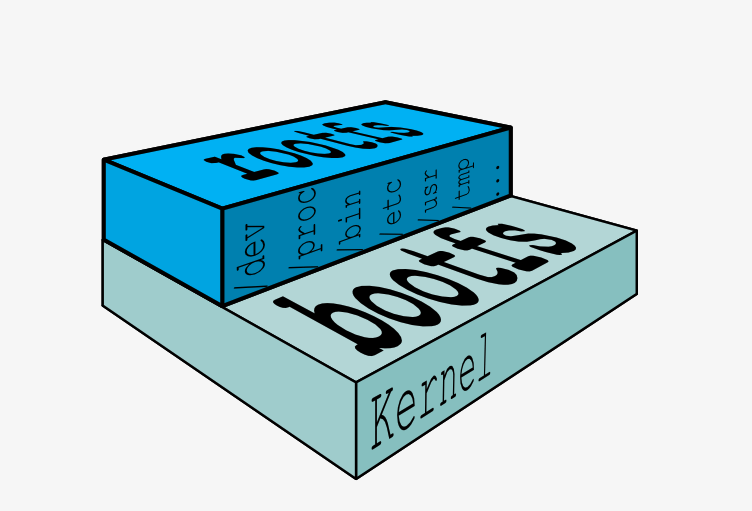
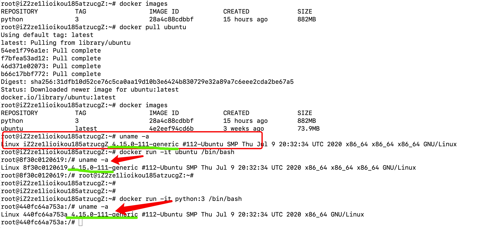
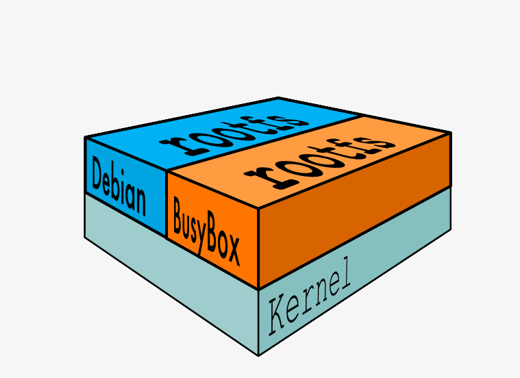

# Docker镜像配置与原理

> Auth: 王海飞
>
> Data：2020-09-011
>
> QQ群：223058292
>
> WX：wanghaifeige
>
> Email：779598160@qq.com
>
> github：https://github.com/coco369/docker-depth-learning
>
> 知乎Docker专栏：<https://zhuanlan.zhihu.com/c_1285288092883734528>
>
> 知乎Python入门专栏：<https://zhuanlan.zhihu.com/c_1277570999509757952>

------

​	Docker 核心：镜像，首先重点讲解一下镜像的基本操作，然后介绍一下镜像的实现原理。

### 1. 镜像	

​	镜像是一个只读的 Docker 容器模板，包含启动容器所需要的所有文件系统结构和内容。简单来讲，**镜像是一个特殊的文件系统**，它提供了容器运行时所需的程序、软件库、资源、配置等静态数据。即镜像不包含任何动态数据，镜像内容在构建后不会被改变。

如何操作镜像：


从图中可知，镜像的操作可分为：

​	拉取镜像，使用docker pull命令拉取远程仓库的镜像到本地 ；

​	重命名镜像，使用docker tag命令“重命名”镜像 ；

​	查看镜像，使用docker image ls或docker images命令查看本地已经存在的镜像 ；

​	删除镜像，使用docker rmi命令删除无用镜像 ；

​	构建镜像，构建镜像有两种方式。第一种方式是使用docker build命令基于 Dockerfile 构建镜像，也是我比较推荐的镜像构建方式；第二种方式是使用docker commit命令基于已经运行的容器提交为镜像。

#### **1.1 拉取镜像**

Docker 镜像的拉取使用**docker pull命令**， 命令格式一般为 **docker pull [Registry]/[Repository]/[Image]:[Tag]**。

- Registry 为注册服务器，Docker 默认会从 docker.io 拉取镜像，如果你有自己的镜像仓库，可以把 Registry 替换为自己的注册服务器。

- Repository 为镜像仓库，通常把一组相关联的镜像归为一个镜像仓库，library为 Docker 默认的镜像仓库。

- Image 为镜像名称。

- Tag 为镜像的标签，如果你不指定拉取镜像的标签，默认为latest。


例如，我们需要获取一个 busybox 镜像，可以执行以下命令：

busybox 是一个集成了数百个 Linux 命令（例如 curl、grep、mount、telnet 等）的精简工具箱，只有几兆大小，被誉为 Linux 系统的瑞士军刀。我经常会使用 busybox 做调试来查找生产环境中遇到的问题。

```
$ docker pull busybox
Using default tag: latest
latest: Pulling from library/busybox
61c5ed1cbdf8: Pull complete
Digest: sha256:4f47c01fa91355af2865ac10fef5bf6ec9c7f42ad2321377c21e844427972977
Status: Downloaded newer image for busybox:latest
docker.io/library/busybox:latest
```

​	实际上执行docker pull busybox命令，都是先从本地搜索，如果本地搜索不到busybox镜像则从 Docker Hub 下载镜像。

#### 1.2 操作镜像

##### 查看镜像

Docker 镜像查看使用**docker images或者docker image ls**命令。

下面我们使用docker images命令列出本地所有的镜像。

```
$ docker images
REPOSITORY          TAG                 IMAGE ID            CREATED             SIZE
nginx               latest              4bb46517cac3        9 days ago          133MB
nginx               1.15                53f3fd8007f7        15 months ago       109MB
busybox             latest              018c9d7b792b        3 weeks ago         1.22MB
```

如果我们想要查询指定的镜像，可以使用docker image ls命令来查询。

```
$ docker image ls busybox
REPOSITORY          TAG                 IMAGE ID            CREATED             SIZE
busybox             latest              018c9d7b792b        3 weeks ago         1.22MB
```

当然你也可以使用docker images命令列出所有镜像，然后使用grep命令进行过滤。使用方法如下：

```
$ docker images |grep busybox
busybox             latest              018c9d7b792b        3 weeks ago         1.22MB
```


**“重命名”镜像**

如果你想要自定义镜像名称或者推送镜像到其他镜像仓库，你可以使用docker tag命令将镜像重命名。docker tag的命令格式为 docker tag [SOURCE_IMAGE][:TAG] [TARGET_IMAGE][:TAG]。

```
$ docker tag busybox:latest mybusybox:latest
```

执行完docker tag命令后，可以使用查询镜像命令查看一下镜像列表：

```
docker images
REPOSITORY          TAG                 IMAGE ID            CREATED             SIZE
busybox             latest              018c9d7b792b        3 weeks ago         1.22MB
mybusybox           latest              018c9d7b792b        3 weeks ago         1.22MB
```

可以看到，镜像列表中多了一个mybusybox的镜像。busybox和mybusybox这两个镜像的 IMAGE ID 是完全一样的。为什么呢？实际上它们指向了同一个镜像文件，只是别名不同而已。

##### 删除镜像

你可以使用**docker rmi或者docker image rm**命令删除镜像。

例：删除mybusybox镜像

```
$ docker rmi mybusybox
此时，再次使用docker images命令查看一下我们机器上的镜像列表。

$ docker images
REPOSITORY          TAG                 IMAGE ID            CREATED             SIZE
busybox             latest              018c9d7b792b        3 weeks ago         1.22MB
通过上面的输出，我们可以看到，mybusybox镜像已经被删除。
```

##### **构建镜像**

构建镜像主要有两种方式：

- **docker commit**命令从运行中的容器提交为镜像；
- **docker build**命令从 Dockerfile 构建镜像。


**Docker commit命令**

首先介绍下如何从运行中的容器提交为镜像。我依旧使用 busybox 镜像举例，使用以下命令创建一个名为 busybox 的容器并进入 busybox 容器。

```
# 创建容器
$ docker run -itd busybox

# 进入容器
$ docker exec -it 容器id /binn/bash
```

执行完上面的命令后，当前窗口会启动一个 busybox 容器并且进入容器中。在容器中，执行以下命令创建一个文件并写入内容：

```
touch hello.txt && echo "I love Docker. " > hello.txt
```

此时在容器的根目录下，已经创建了一个 hello.txt 文件，并写入了 "I love Docker. "。下面，我们新打开另一个命令行窗口，运行以下命令提交镜像：

```
$ docker commit busybox busybox:hello
sha256:cbc6406aaef080d1dd3087d4ea1e6c6c9915ee0ee0f5dd9e0a90b03e2215e81c
```

然后使用上面讲到的docker image ls命令查看镜像：

```
$ docker image ls busybox
REPOSITORY          TAG                 IMAGE ID            CREATED             SIZE
busybox             hello               cbc6406aaef0        2 minutes ago       1.22MB
busybox             latest              018c9d7b792b        4 weeks ago         1.22MB
```

此时我们可以看到主机上新生成了 busybox:hello 这个镜像。


**Docker build命令**

最常用的镜像构建方式：Dockerfile。Dockerfile 是一个包含了用户所有构建命令的文本。**通过docker build命令可以从 Dockerfile 生成镜像。**

使用 Dockerfile 构建镜像具有以下特性：

- Dockerfile 的每一行命令都会生成一个独立的镜像层，并且拥有唯一的 ID；

- Dockerfile 的命令是完全透明的，通过查看 Dockerfile 的内容，就可以知道镜像是如何一步步构建的；

- Dockerfile 是纯文本的，方便跟随代码一起存放在代码仓库并做版本管理。


先学习下 Dockerfile 常用的指令。

Dockerfile 指令	指令简介

- FROM	Dockerfile 除了注释第一行必须是 FROM ，FROM 后面跟镜像名称，代表我们要基于哪个基础镜像构建我们的容器。（ **默认会先从本地去查找镜像**）
- RUN	RUN 后面跟一个具体的命令，类似于 Linux 命令行执行命令。
- ADD	拷贝本机文件或者远程文件到镜像内
- COPY	拷贝本机文件到镜像内
- USER	指定容器启动的用户
- ENTRYPOINT	容器的启动命令
- CMD	CMD 为 ENTRYPOINT 指令提供默认参数，也可以单独使用 CMD 指定容器启动参数
- ENV	指定容器运行时的环境变量，格式为 key=value
- ARG	定义外部变量，构建镜像时可以使用 build-arg = 的格式传递参数用于构建
- EXPOSE	指定容器监听的端口，格式为 [port]/tcp 或者 [port]/udp
- WORKDIR	为 Dockerfile 中跟在其后的所有 RUN、CMD、ENTRYPOINT、COPY 和 ADD 命令设置工作目录。


先分析下如下Dockerfile文件中的含义：

```dockerfile
FROM centos:7
COPY nginx.repo /etc/yum.repos.d/nginx.repo
RUN yum install -y nginx
EXPOSE 80
ENV HOST=mynginx
CMD ["nginx","-g","daemon off;"]
```

- 第一行表示我要基于 centos:7 这个镜像来构建自定义镜像。这里需要注意，每个 Dockerfile 的第一行除了注释都必须以 FROM 开头。

- 第二行表示拷贝本地文件 nginx.repo 文件到容器内的 /etc/yum.repos.d 目录下。这里拷贝 nginx.repo 文件是为了添加 nginx 的安装源。

- 第三行表示在容器内运行yum install -y nginx命令，安装 nginx 服务到容器内，执行完第三行命令，容器内的 nginx 已经安装完成。

- 第四行声明容器内业务（nginx）使用 80 端口对外提供服务。

- 第五行定义容器启动时的环境变量 HOST=mynginx，容器启动后可以获取到环境变量 HOST 的值为 mynginx。

- 第六行定义容器的启动命令，命令格式为 json 数组。这里设置了容器的启动命令为 nginx ，并且添加了 nginx 的启动参数 -g 'daemon off;' ，使得 nginx 以前台的方式启动。


上面这个 Dockerfile 的例子基本涵盖了常用的镜像构建指令。

### 2. 镜像的实现原理

#### 2.1 Bootfs和Rootfs

先下拉ubuntu镜像和python:3镜像：

```python
root@iZ2ze1lioikou185atzucgZ:~# docker pull ubuntu

Using default tag: latest

latest: Pulling from library/ubuntu

54ee1f796a1e: Pull complete 

f7bfea53ad12: Pull complete 

46d371e02073: Pull complete 

b66c17bbf772: Pull complete 

Digest: sha256:31dfb10d52ce76c5ca0aa19d10b3e6424b830729e32a89a7c6eee2cda2be67a5

Status: Downloaded newer image for ubuntu:latest

docker.io/library/ubuntu:latest

root@iZ2ze1lioikou185atzucgZ:~# docker images

REPOSITORY          TAG                 IMAGE ID            CREATED             SIZE

python              3                   28a4c88cdbbf        15 hours ago        882MB

ubuntu              latest              4e2eef94cd6b        3 weeks ago         73.9MB
```

大家可能注意到上面命令输出的最后一列， 它显示 ubuntu 这个镜像才 73.9MB ！但是大家应该都知道，安装一个 ubuntu 系统怎么也不可能就几十兆，那么 Docker 是怎么做到的呢？

这是因为典型的 Linux 运行需要两个 FS: **bootfs 和 rootfs**，Linux 刚启动时会加载 bootfs 文件系统，之后 bootfs 会被卸载掉。对于不同的 Linux 发行版, bootfs 基本是一致的, 但 rootfs 会有差别，其包含我们熟悉的 /dev, /proc, /bin 等目录。对于 ubuntu 镜像来说，其底层直接使用 Host 的 **kernel内核**，自己只需要提供 rootfs 就行了。如下图所示：




为了确定 ubuntu 镜像使用的是 Host 的Kernel内核，我们可以使用**uname -a命令查看内核版本**：



说明如下：

```
第一个组数字：4, 主版本号
第二个组数字：15, 次版本号，当前为稳定版本
第三个组数字：0, 修订版本号
第四个组数字：111，当前内核版本（4.15.0）的第111次微调patch
generic：当前内核版本为通用版本，另有表示不同含义的server（针对服务器）、i386（针对老式英特尔处理器）
pae（Physical Address Extension）：物理地址扩展，为了弥补32位地址在PC服务器应用上的不足而推出，表示此32位系统可以支持超过4G的内存
x86_64：采用的是64位的CPU
SMP：对称多处理机，表示内核支持多核、多处理器
Tue Jul 15 17:46:11 UTC 2014：内核的编译时间（build date）为 2014/07/15 17:46:11  
```

**重点：**如果我们在同一个 host 上下载不同 Linux 发行版镜像，如python:3和Ubuntu，可以从上图中发现其都是使用的公用 host 的 bootfs。抽象一下，如下图所示：



理解到bootfs和rootfs后，就可以解释什么是镜像分层了。

#### 2.1 镜像分层

​	每个镜像都是通过 DockerFile 文本文件定义的，Dockerfile 中的每条指令最终都会成为镜像中的 Layer。Layer 是按顺序构成的，**最底层的 Layer 是基础镜像（base image），最上层是最终镜像（final image）**。当一个镜像被更新或重新构建时，只有更新的层需要修改，其他没有更新的层可以直接复用本地缓存。这就是 Docker 镜像如此快速和轻量级的部分原因，每一层的大小加起来等于最终镜像的大小。


