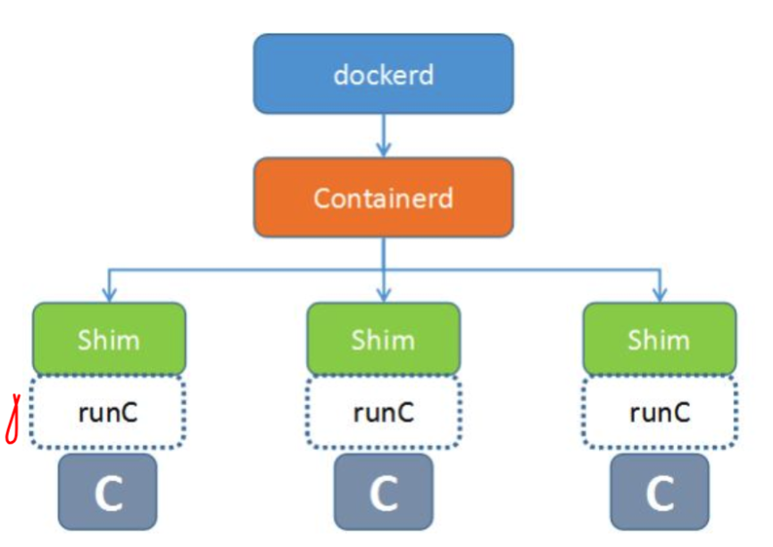
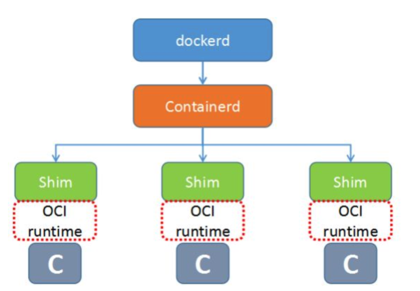
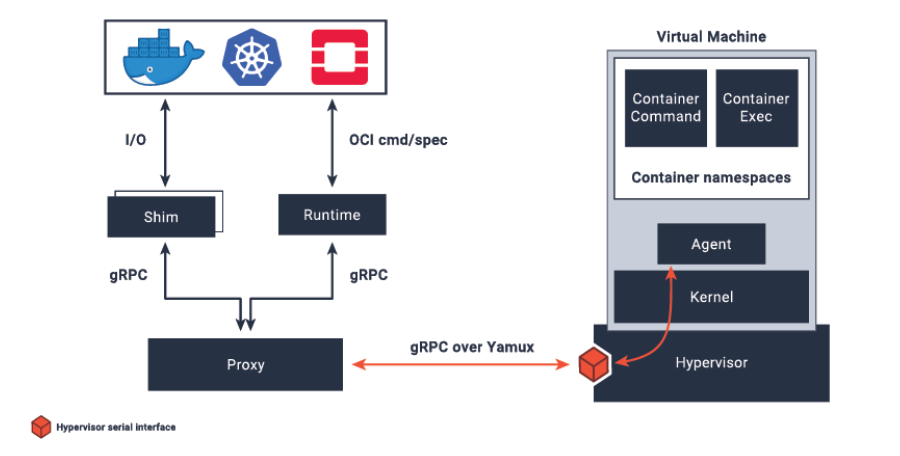
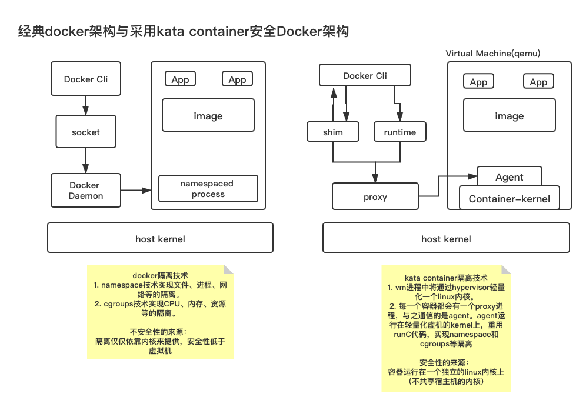

# Docker安全性能提升

> Auth: 王海飞
>
> Data：2020-09-22
>
> QQ群：223058292
>
> WX：wanghaifeige
>
> Email：779598160@qq.com
>
> github：https://github.com/coco369/docker-depth-learning
>
> 知乎Docker专栏：<https://zhuanlan.zhihu.com/c_1285288092883734528>
>
> 知乎Python入门专栏：<https://zhuanlan.zhihu.com/c_1277570999509757952>

### 1. 前言

​	Docker容器安全目前推荐的技术方案是 : **Kata Containers**，那先来认识一下什么是kata containers。

​	Kata Containers是一个开源项目和社区，致力于**构建轻量级虚拟机（VM）的标准实现——这些虚拟机的感知和执行类似容器**，但提供VM的工作负载隔离和安全优势，内核级别的隔离宿主机的内核！Kata Containers 项目最初是基于 **QEMU** 的，但它的设计从一开始就以支持多种管理程序解决方案为出发点。

### 2. kata-containers

　　kata containers是由OpenStack基金会管理，但独立于OpenStack项目之外的容器项目。它是一个**可以使用容器镜像以超轻量级虚机的形式创建容器的运行时工具**。 kata containers整合了Intel的 Clear Containers 和 Hyper.sh 的 runV，能够支持不同平台的硬件 （x86-64，arm等），并符合**OCI(Open Container Initiative)**规范，同时还可以兼容k8s的 **CRI（Container Runtime Interface）**接口规范。目前项目包含几个配套组件，即Runtime，Agent， Proxy，Shim，Kernel等

　　真正启动Docker容器的命令工具是RunC，它是OCI运行时规范 (runtime-spec)的默认实现。Kata containers其实跟RunC类似，也是一个符合OCI运行时规范的一种 实现（即**Clear Container和runV 都符OCI规范**），不同之处是，它给每个容器（在Docker容器的 角度）或每个Pod（k8s的角度）增加了一个独立的linux内核（不共享宿主机的内核），使容器有更好 的隔离性，安全性。

**2.1）docker的runtime模式架构图：**

​	可以看到runC处于docker组件图的最底端，runC下面就是容器。目前docker已经不是一个专一的容器 管理组件，而真正的容器管理组件是containerd，而containerd本身也不会直接跟操作系统交互，去创建、删除容器，而是借助runC来对容器生命周期进行管理，因此runC作为必须遵循OCI规范。

**2.2）kata containers定义位置：**

kata containers在容器的什么位置，应该就显而易见了。它符合OCI运行时规 范，因此，可以作为runC的替代组件，如红色虚线框内所示：

**2.3）kata container原理**

​	kata container实质上是在虚拟机内部使用container（基于runc的实现）。 kata-container使用虚拟化软件(qemu-lite优化过的qemu)， 通过已经将kata-agent 安装的kernel & intrd image，启动过一个轻量级的虚拟机， 使用nvdimm将initrd image映射到guest vm中。然后由kata-agent为container创建对应的namespace和资源。 Guest VM作为实质上的sandbox可以完全与host kernel进行隔离。

**组件拆分介绍**

- **kata-runtime**：实现OCI接口，可以通过CRI-O 与kubelet对接作为k8s runtime server， containerd对接docker engine，创建运行container/pod的VM
- **kata-proxy**: 每一个container都会由一个kata-proxy进程，kata-proxy负责与kata-agent通讯，当guest vm启动后，kata-agent会随之启动并使用qemu virtio serial console 进行通讯
- **kata-agent**： 运行在guest vm中的进程， 主要依赖于**libcontainer**项目，重用了大部分的runc代码，为container创建namespace(NS, UTS, IPC and PID)
- **kata-shim**: 作为guest vm标准输入输出的接口，exec命令就是同kata-shim实现的。（其实相当于是container-shim的一个适配）

**2.4）classic Docker与Docker with Kata的架构**

