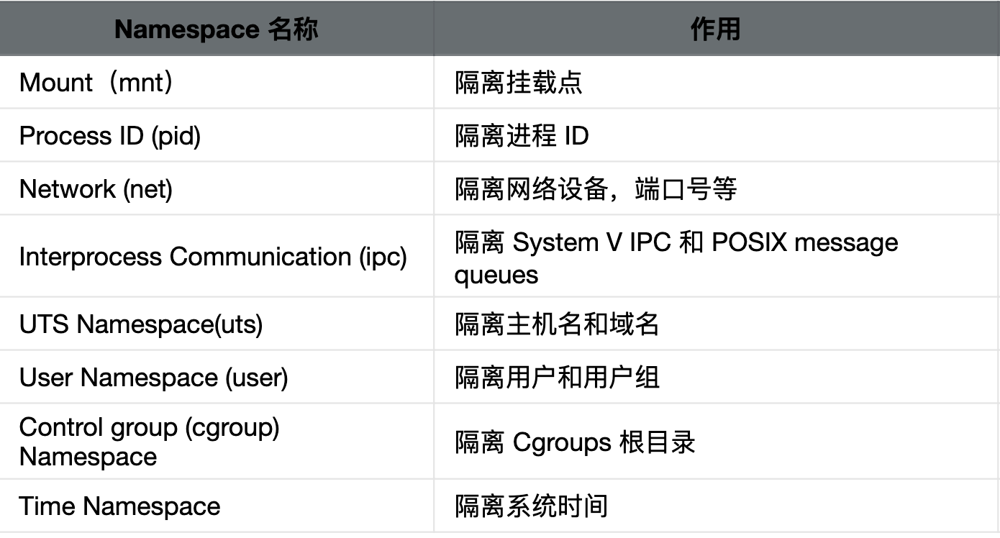

# Docker资源隔离：Namespace

> Auth: 王海飞
>
> Data：2020-09-28
>
> QQ群：223058292
>
> WX：wanghaifeige
>
> Email：779598160@qq.com
>
> github：https://github.com/coco369/docker-depth-learning
>
> 知乎Docker专栏：<https://zhuanlan.zhihu.com/c_1285288092883734528>
>
> 知乎Python入门专栏：<https://zhuanlan.zhihu.com/c_1277570999509757952>

### 1. 前言

​	在上一章Docker安全性能中已有讲解Namespace的功能作用。

​	概念回顾：Docker 是基于 Linux 内核的 **Namespace** 技术实现资源隔离的，**所有的容器都共享主机的内核**。其实这与以虚拟机为代表的云计算时代还是有很多区别的，比如虚拟机有着更好的隔离性和安全性，而容器的隔离性和安全性则相对较弱。

​	虽然Namespace的技术的隔离和安全性相对较弱，那么究竟什么是 Namespace，各种 Namespace 都有什么作用，为什么 Docker 需要 Namespace呢？

### 2.什么是Namespace

​	**维基百科定义**：Namespace 是 Linux 内核的一项功能，该功能对内核资源进行分区，以使一组进程看到一组资源，而另一组进程看到另一组资源。Namespace 的工作方式通过为一组资源和进程设置相同的 Namespace 而起作用，但是这些 Namespace 引用了不同的资源。资源可能存在于多个 Namespace 中。这些资源可以是进程 ID、主机名、用户 ID、文件名、与网络访问相关的名称和进程间通信。

​	**简单来说，**Namespace 是 Linux 内核的一个特性，该**特性可以实现在同一主机系统中，对进程 ID、主机名、用户 ID、文件名、网络和进程间通信等资源的隔离**。Docker 利用 Linux 内核的 Namespace 特性，**实现了每个容器的资源相互隔离，从而保证容器内部只能访问到自己 Namespace 的资源**。




### 3.Namespace的作用

下面分别讲解六种Namespace的运用：
**1）Mount Namespace**
​	**Mount Namespace 是 Linux 内核实现的第一个 Namespace，**从内核的 2.4.19 版本开始加入。它可以用来隔离不同的进程或进程组看到的挂载点。通俗地说，就是可以实现在不同的进程中看到不同的挂载目录。使用 Mount Namespace 可以实现容器内只能看到自己的挂载信息，在容器内的挂载操作不会影响主机的挂载目录。

​	**unshare** 是 util-linux 工具包中的一个工具，CentOS 7 系统默认已经集成了该工具，使用 unshare 命令可以实现创建并访问不同类型的 Namespace。

首先我们使用以下命令创建一个 bash 进程并且新建一个 Mount Namespace：

```
$ sudo unshare --mount --fork /bin/bash
```

执行完上述命令后，这时我们已经在主机上创建了一个新的 Mount Namespace，并且当前命令行窗口加入了新创建的 Mount Namespace。下面我通过一个例子来验证下，**在独立的 Mount Namespace 内创建挂载目录是不影响主机的挂载目录的。**

首先在 /tmp 目录下创建一个目录。

```
[root@centos7 centos]# mkdir /tmp/tmpfs
```

创建好目录后使用 mount 命令挂载一个 tmpfs 类型的目录。命令如下：

```
[root@centos7 centos]# mount -t tmpfs -o size=20m tmpfs /tmp/tmpfs
```

然后使用 df 命令查看一下已经挂载的目录信息：

```
[root@centos7 centos]# df -h
Filesystem      Size  Used Avail Use% Mounted on
/dev/vda1       500G  1.4G  499G   1% /
devtmpfs         16G     0   16G   0% /dev
tmpfs            16G     0   16G   0% /dev/shm
tmpfs            16G     0   16G   0% /sys/fs/cgroup
tmpfs            16G   57M   16G   1% /run
tmpfs           3.2G     0  3.2G   0% /run/user/1000
tmpfs            20M     0   20M   0% /tmp/tmpfs
```

可以看到 /tmp/tmpfs 目录已经被正确挂载。为了验证主机上并没有挂载此目录，我们新打开一个命令行窗口，同样执行 df 命令查看主机的挂载信息：

```
[centos@centos7 ~]$ df -h
Filesystem      Size  Used Avail Use% Mounted on
devtmpfs         16G     0   16G   0% /dev
tmpfs            16G     0   16G   0% /dev/shm
tmpfs            16G   57M   16G   1% /run
tmpfs            16G     0   16G   0% /sys/fs/cgroup
/dev/vda1       500G  1.4G  499G   1% /
tmpfs           3.2G     0  3.2G   0% /run/user/1000
```

通过上面输出可以看到主机上并没有挂载 /tmp/tmpfs，可见我们独立的 Mount Namespace 中执行 mount 操作并不会影响主机。

为了进一步验证我们的想法，我们继续在当前命令行窗口查看一下当前进程的 Namespace 信息，命令如下：

```
[root@centos7 centos]# ls -l /proc/self/ns/
total 0
lrwxrwxrwx. 1 root root 0 Sep  4 08:20 ipc -> ipc:[4026531839]
lrwxrwxrwx. 1 root root 0 Sep  4 08:20 mnt -> mnt:[4026532239]
lrwxrwxrwx. 1 root root 0 Sep  4 08:20 net -> net:[4026531956]
lrwxrwxrwx. 1 root root 0 Sep  4 08:20 pid -> pid:[4026531836]
lrwxrwxrwx. 1 root root 0 Sep  4 08:20 user -> user:[4026531837]
lrwxrwxrwx. 1 root root 0 Sep  4 08:20 uts -> uts:[4026531838]
```

然后新打开一个命令行窗口，使用相同的命令查看一下主机上的 Namespace 信息：

```
[centos@centos7 ~]$ ls -l /proc/self/ns/
total 0
lrwxrwxrwx. 1 centos centos 0 Sep  4 08:20 ipc -> ipc:[4026531839]
lrwxrwxrwx. 1 centos centos 0 Sep  4 08:20 mnt -> mnt:[4026531840]
lrwxrwxrwx. 1 centos centos 0 Sep  4 08:20 net -> net:[4026531956]
lrwxrwxrwx. 1 centos centos 0 Sep  4 08:20 pid -> pid:[4026531836]
lrwxrwxrwx. 1 centos centos 0 Sep  4 08:20 user -> user:[4026531837]
lrwxrwxrwx. 1 centos centos 0 Sep  4 08:20 uts -> uts:[4026531838]
```

通过对比两次命令的输出结果，我们可以看到，除了 Mount Namespace 的 ID 值不一样外，其他Namespace 的 ID 值均一致。

通过以上结果我们可以得出结论，使用 unshare 命令可以新建 Mount Namespace，并且在新建的 Mount Namespace 内 mount 是和外部完全隔离的。

**2）PID Namespace**
​	**PID Namespace 的作用是用来隔离进程**。在不同的 PID Namespace 中，进程可以拥有相同的 PID 号，利用 PID Namespace 可以实现每个容器的主进程为 1 号进程，而容器内的进程在主机上却拥有不同的PID。例如一个进程在主机上 PID 为 122，使用 PID Namespace 可以实现该进程在容器内看到的 PID 为 1。

下面演示PID Namespace的作用。创建一个 bash 进程，并且新建一个 PID Namespace：

```
$ sudo unshare --pid --fork --mount-proc /bin/bash
```

执行完上述命令后，我们在主机上创建了一个新的 PID Namespace，并且当前命令行窗口加入了新创建的 PID Namespace。在当前的命令行窗口使用 ps aux 命令查看一下进程信息：

```
[root@centos7 centos]# ps aux
USER       PID %CPU %MEM    VSZ   RSS TTY      STAT START   TIME COMMAND
root         1  0.0  0.0 115544  2004 pts/0    S    10:57   0:00 bash
root        10  0.0  0.0 155444  1764 pts/0    R+   10:59   0:00 ps aux
```

通过上述命令输出结果可以看到当前 Namespace 下 bash 为 1 号进程，而且我们也看不到主机上的其他进程信息。

**3）UTS Namespace**
​	**UTS Namespace 主要是用来隔离主机名的**，它允许每个 UTS Namespace 拥有一个独立的主机名。例如我们的主机名称为 docker，使用 UTS Namespace 可以实现在容器内的主机名称为 utsdocker 或者其他任意自定义主机名。

同样我们通过一个实例来验证下 UTS Namespace 的作用，首先我们使用 unshare 命令来创建一个 UTS Namespace：

```
$ sudo unshare --uts --fork /bin/bash
```

创建好 UTS Namespace 后，当前命令行窗口已经处于一个独立的 UTS Namespace 中，下面我们使用 hostname 命令（hostname 可以用来查看主机名称）设置一下主机名：

```
root@centos7 centos]# hostname -b utsdocker
```

然后再查看一下主机名：

```
[root@centos7 centos]# hostname
utsdocker
```

通过上面命令的输出，我们可以看到当前UTS Namespace 内的主机名已经被修改为 utsdocker。然后我们新打开一个命令行窗口，使用相同的命令查看一下主机的 hostname：

```
[centos@centos7 ~]$ hostname
centos7
```

可以看到主机的名称仍然为 centos7，并没有被修改。由此，可以验证 UTS Namespace 可以用来隔离主机名。

**4）IPC Namespace**
​	**IPC Namespace 主要是用来隔离进程间通信的**。**PID Namespace 和 IPC Namespace 一起使用可以实现同一 IPC Namespace 内的进程彼此可以通信**，不同 IPC Namespace 的进程却不能通信。

使用 unshare 命令来创建一个 IPC Namespace：

```
$ sudo unshare --ipc --fork /bin/bash
```

下面我们需要借助两个命令来实现对 IPC Namespace 的验证。

- ipcs -q 命令：用来查看系统间通信队列列表。

- ipcmk -Q 命令：用来创建系统间通信队列。


我们首先使用 ipcs -q 命令查看一下当前 IPC Namespace 下的系统通信队列列表：

```
[centos@centos7 ~]$ ipcs -q
------ Message Queues --------
key        msqid      owner      perms      used-bytes   messages
```

由上可以看到当前无任何系统通信队列，然后我们使用 ipcmk -Q 命令创建一个系统通信队列：

```
[root@centos7 centos]# ipcmk -Q
Message queue id: 0
```

再次使用 ipcs -q 命令查看当前 IPC Namespace 下的系统通信队列列表：

```
[root@centos7 centos]# ipcs -q
------ Message Queues --------
key        msqid      owner      perms      used-bytes   messages
0x73682a32 0          root       644        0            0
```

可以看到我们已经成功创建了一个系统通信队列。然后我们新打开一个命令行窗口，使用ipcs -q 命令查看一下主机的系统通信队列：

```
[centos@centos7 ~]$ ipcs -q
------ Message Queues --------
key        msqid      owner      perms      used-bytes   messages
```

通过上面的实验，可以发现，在单独的 IPC Namespace 内创建的系统通信队列在主机上无法看到。即 IPC Namespace 实现了系统通信队列的隔离。

**5）User Namespace**
​	**User Namespace 主要是用来隔离用户和用户组的**。一个比较典型的应用场景就是在主机上以非 root 用户运行的进程可以在一个单独的 User Namespace 中映射成 root 用户。使用 User Namespace 可以实现进程在容器内拥有 root 权限，而在主机上却只是普通用户。

User Namesapce 的创建是可以不使用 root 权限的。下面我们以普通用户的身份创建一个 User Namespace，命令如下：

```
[centos@centos7 ~]$ unshare --user -r /bin/bash
```

CentOS7 默认允许创建的 User Namespace 为 0，如果执行上述命令失败（ unshare 命令返回的错误为 unshare: unshare failed: Invalid argument ），需要使用以下命令修改系统允许创建的 User Namespace 数量，命令为：echo 65535 > /proc/sys/user/max_user_namespaces，然后再次尝试创建 User Namespace。

然后执行 id 命令查看一下当前的用户信息：

```
[root@centos7 ~]# id
uid=0(root) gid=0(root) groups=0(root),65534(nfsnobody) context=unconfined_u:unconfined_r:unconfined_t:s0-s0:c0.c1023
```

通过上面的输出可以看到我们在新的 User Namespace 内已经是 root 用户了。下面我们使用只有主机 root 用户才可以执行的 reboot 命令来验证一下，在当前命令行窗口执行 reboot 命令：

```
[root@centos7 ~]# reboot
Failed to open /dev/initctl: Permission denied
Failed to talk to init daemon.
```

可以看到，我们在新创建的 User Namespace 内虽然是 root 用户，但是并没有权限执行 reboot 命令。这说明在隔离的 User Namespace 中，并不能获取到主机的 root 权限，也就是说 User Namespace 实现了用户和用户组的隔离。

**6）Net Namespace**
​	**Net Namespace 是用来隔离网络设备、IP 地址和端口等信息的**。Net Namespace 可以让每个进程拥有自己独立	的 IP 地址，端口和网卡信息。例如主机 IP 地址为 172.16.4.1 ，容器内可以设置独立的 IP 地址为 192.168.1.1。

同样用实例验证，我们首先使用 ip a 命令查看一下主机上的网络信息：

```
$ ip a
1: lo: <LOOPBACK,UP,LOWER_UP> mtu 65536 qdisc noqueue state UNKNOWN group default qlen 1000
    link/loopback 00:00:00:00:00:00 brd 00:00:00:00:00:00
    inet 127.0.0.1/8 scope host lo
       valid_lft forever preferred_lft forever
    inet6 ::1/128 scope host
       valid_lft forever preferred_lft forever
2: eth0: <BROADCAST,MULTICAST,UP,LOWER_UP> mtu 1500 qdisc pfifo_fast state UP group default qlen 1000
    link/ether 02:11:b0:14:01:0c brd ff:ff:ff:ff:ff:ff
    inet 172.20.1.11/24 brd 172.20.1.255 scope global dynamic eth0
       valid_lft 86063337sec preferred_lft 86063337sec
    inet6 fe80::11:b0ff:fe14:10c/64 scope link
       valid_lft forever preferred_lft forever
3: docker0: <NO-CARRIER,BROADCAST,MULTICAST,UP> mtu 1500 qdisc noqueue state DOWN group default
    link/ether 02:42:82:8d:a0:df brd ff:ff:ff:ff:ff:ff
    inet 172.17.0.1/16 scope global docker0
       valid_lft forever preferred_lft forever
    inet6 fe80::42:82ff:fe8d:a0df/64 scope link
       valid_lft forever preferred_lft forever
```

然后我们使用以下命令创建一个 Net Namespace：

```
$ sudo unshare --net --fork /bin/bash
```

同样的我们使用 ip a 命令查看一下网络信息：

```
[root@centos7 centos]# ip a
1: lo: <LOOPBACK> mtu 65536 qdisc noop state DOWN group default qlen 1000
    link/loopback 00:00:00:00:00:00 brd 00:00:00:00:00:00
```

可以看到，宿主机上有 lo、eth0、docker0 等网络设备，而我们新建的 Net Namespace 内则与主机上的网络设备不同。


### 4. 总结

​	Linux 内核从 2002 年 2.4.19 版本开始加入了 Mount Namespace，而直到内核 3.8 版本加入了 User Namespace 才为容器提供了足够的支持功能。

​	当 Docker 新建一个容器时， 它会创建这六种 Namespace，然后将容器中的进程加入这些 Namespace 之中，使得 Docker 容器中的进程只能看到当前 Namespace 中的系统资源。

​	正是由于 Docker 使用了 Linux 的这些 Namespace 技术，才实现了 Docker 容器的隔离，可以说没有 Namespace，就没有 Docker 容器。