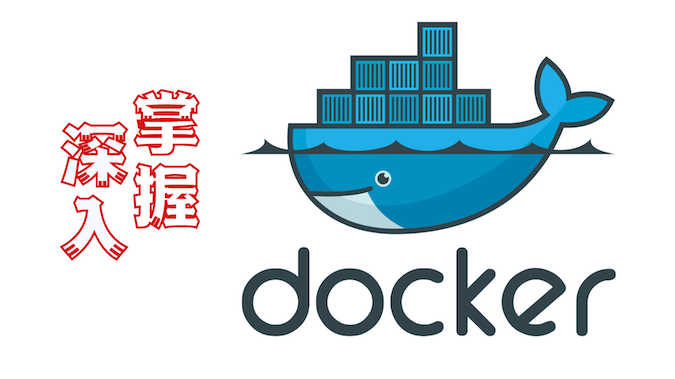

# docker深度学习
​	

Docker深入了解与掌握：    

Docker的学习大致分为5个阶段：Docker基础内容、Docker底层技术、Docker框架设计、Docker容器编排、Docker实战案例

**目录：**

#### 1. Docker基础内容：

- [docker技术原理了解](1.Docker技术原理.md)
- [docker核心设计概念：镜像，容器，仓库](2.Docker容器、镜像、仓库.md)
- [docker镜像配置与原理](3.Docker镜像配置与原理.md)
- [docker容器的使用](4.Docker容器的使用.md)
- [Dockerfile的编写规则](5.Dockerfile的编写规则.md)
- [docker安全性能了解](7.Docker安全性能了解.md)

#### **2. Docker底层技术：**

- [docker底层资源隔离：Namespace](9.Docker底层资源隔离namespace.md)
- [docker底层资源限制：Cgroups](10.Docker底层资源限制cgroups.md)

#### 3. Docker架构设计：

- [docker架构设计](6.Docker架构设计.md)
- [docker安全性能提升(kata container)](8.Docker安全性能提升.md)

#### 4. Docker容器编排

#### 5. Docker实战案例

 - [使用go开发docker](./实战演示/(实战)Go开发Docker实战.md)

