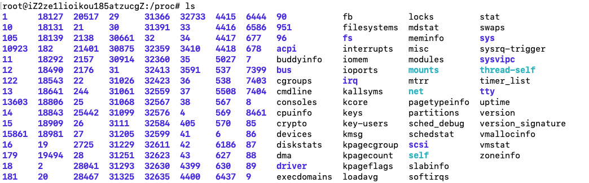

# （实战）Go开发Docker

> Auth: 王海飞 
>
> Data：2020-11-30
>
> QQ群：223058292
>
> WX：wanghaifeige
>
> Email：779598160@qq.com
>
> github：https://github.com/coco369/docker-depth-learning
>
> 知乎Docker专栏：<https://zhuanlan.zhihu.com/c_1285288092883734528>
>
> 知乎Python入门专栏：<https://zhuanlan.zhihu.com/c_1277570999509757952>

### 1. 前言

**Golang 是什么?**

​	Golang 又称为 Go，是 Google 开源的一种静态编译型语言。由于 Golang 较高的开发效率和执行效率，很快便从众多编程语言中脱颖而出。同时，Docker 和 Kubernetes 等众多项目也都是使用 Golang 开发的。因此，熟练掌握 Golang 将会为你加分很多。

#### 2. 编写Docker

##### Linux Proc 文件系统

​	Linux 系统中，/proc 目录是一种“文件系统”，其实 /proc 目录并不是一个真正的文件系统。/proc 目录存放于内存中，是一个虚拟的文件系统，该目录存放了当前内核运行状态的一系列特殊的文件，你可以通过这些文件查看当前的进程信息。

​	可以看到，这个目录下有很多数字，这些数字目录实际上是以进程 ID 命名的。除了这些以进程 ID 命名的目录，还有一些特殊的目录，这里我讲解一下与编写 Docker 有关的文件和目录。

**self 目录：**它是连接到当前正在运行的进程目录，比如我当前的进程 ID 为 30097，则 self 目录实际连接到 /proc/30097 这个目录。

**/proc/{PID}/exe 文件**：exe 连接到进程执行的命令文件，例如 30097 这个进程的运行命令为 docker，则执行 /proc/30097/exe ps 等同于执行 docker ps。

精简版 Docker 是使用 Golang 编写，因此编写的 Docker 命名为 gocker 。

